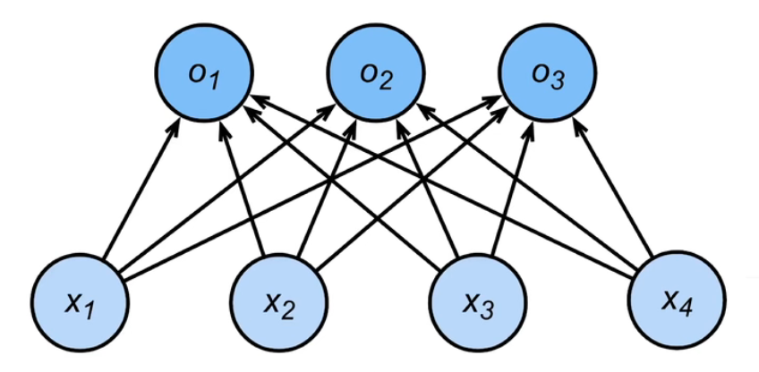

# Softmax

## 定义

### 熵

系统的不确定性程度，或系统的混乱程度。

#### 信息熵

$$
H(X)=-\sum_{i=1}^n p(x_i)\log p(x_i)
$$

$X$：随机变量
$p(x)$：$X$的概率函数

###### 实例

| X    | Probability |
| ---- | ----------- |
| 1    | 0.6         |
| 2    | 0.1         |
| 3    | 0.1         |
| 4    | 0.1         |
| 5    | 0.1         |

$$
H(X)=-0.6\log 0.6+4\times-0.1\log0.1\approx0.53308
$$

#### 相对熵（KL散度）

两个概率分布之间的非对称性度量
$$
D_{KL}(p||q)=\sum_{i=1}^np(x_i)\log(\frac{p(x_i)}{q(x_i)})
$$

$$
D_{KL}(p||q)=H(P,Q)-H(P)
$$

KL散度=交叉熵-信息熵

#### 交叉熵

主要应用：度量随机变量$X$的预测分布$Q$与真实分布$P$之间的差距
$$
H(P,Q)=-\sum_{i=1}^n p(x_i)\log q(x_i)
$$

###### 实例

俺给大家打个比方：大家当分类1 2 3为猫狗鼠，识别图片给出预测。

| 分类 | 预测值$Q(x)$ | 真实标签$P(x)$ |
| ---- | ------------ | -------------- |
| 1    | 0.7          | 1              |
| 2    | 0.1          | 0              |
| 3    | 0.2          | 0              |

$$
H(P,Q)=-1\log 0.7=0.1549
$$

相对准确的预测。

| 分类 | 预测值$Q(x)$ | 真实标签$P(x)$ |
| ---- | ------------ | -------------- |
| 1    | 0.3          | 1              |
| 2    | 0.6          | 0              |
| 3    | 0.1          | 0              |

$$
H(P,Q)=0.5229
$$

不准确的预测。

| 分类 | 预测值$Q(x)$ | 真实标签$P(x)$ |
| ---- | ------------ | -------------- |
| 1    | 0.1          | 0              |
| 2    | 0.1          | 0              |
| 3    | 0.8          | 1              |

$$
H(P,Q)=0.0969
$$

几乎准确的预测。

##### 交叉熵：总结

1. 预测越准确，交叉熵越小。
2. 交叉熵只和真实标签的预测概率有关。(真实标签为one hot时)

##### 最简公式

$$
\text{Corss\_Entropy}(p,q)=-\log q(c_i)
$$

### Sigmoid函数

$$
S(x)=\frac 1{1+e^{-x}}
$$

## 一些损失函数

### L2 Loss

$$
l(y,y')=\frac 1 2 (y-y')^2
$$

### L1 Loss

$$
l(y,y')=\abs{y-y'}
$$

### Huber’s Robust Loss

$$
l(y,y')=
\begin{cases}
\abs{y-y'}-\frac 1 2& if\abs{y-y'}>1\\
\frac 1 2(y-y')^2&otherwise
\end{cases}
$$

## Softmax回归

softmax在于将输出匹配概率（非负、和为1）

#### 处理输出

$$
\hat {\pmb y}=softmax(\pmb o)\\
\hat y_i=\frac{\exp(o_i)}{\sum_k\exp(o_k)}
$$

#### 损失函数

交叉熵（衡量两个概率的区别）
$$
l(y,\hat y)=-\sum_iy_i\log\hat y_i=-\log \hat y_y
$$
因为是one hot编码，只有$y_y$是$1$，其余都是$0$，因此只有符合预期的预测概率$\hat y_y$有效。

只关心对正确类的预测值。

现在对$o_i$求损失函数的梯度
$$
l(y,\hat y)=-\sum_ky_k\log\hat y_k=
\log\sum_k\exp(o_k)-\sum_ky_ko_k
\\
\part_{o_k}l(\pmb y,\pmb {\hat y})=\frac{\exp(o_k)}{\sum_k\exp(o_k)}-y_k=\mathrm {softmax}(o_k)-y_k\\
\text{特别的，只有}y_y=1,其余y_k=0,k\not=y
$$
梯度是预测概率与真实概率的差异。

## 动手做：图片分类