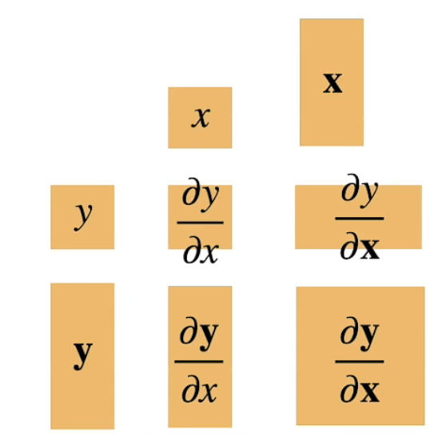
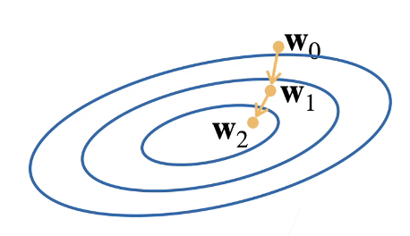

# Week 1 ML 学习总结 机器学习的环境与数学基础

## 机器学习环境搭建

笔者采用的环境/框架是`Python` `CUDA` `Torch`

### 具体步骤

1. 安装Anaconda，部署Python, Jupyter Notebook等的环境。

2. ### 在Conda的Console中使用`conda install`命令安装`pytorch`的GPU版本。

   ```bash
   # for Windows
   conda install pytorch torchvision torchaudio cudatoolkit=11.3 -c pytorch
   ```

   完成。

## 定义

### 梯度

梯度是对导数的扩充。



##### 标量函数对向量的梯度

$$
\pmb x=\begin{bmatrix}
x_1\\x_2\\\vdots \\x_n
\end{bmatrix}
\ ~~~\frac{\partial y}{\partial \pmb x}=\begin{bmatrix}
\frac{\partial y}{\partial x_1},\frac{\partial y}{\partial x_2},\cdots,\frac{\partial y}{\partial x_n}
\end{bmatrix}
$$

梯度指向了值变化最大的方向。

###### 实例

$$
\frac{\partial (x_1^2+2x_2^2)}{\partial \pmb x}=
\begin{bmatrix}
2x_1,4x_2
\end{bmatrix}
$$

##### 标量函数对向量的梯度

###### 例子

$$
\begin{array}{c|cccc}
y&a&au&sum(\pmb x)&\lVert\pmb x\rVert^2\\
\hline
\frac{\part y}{\part \pmb x}&
\pmb 0^T &
a\frac{\part u}{\part\pmb x}&
\pmb 1^T&
2\pmb x^T
\end{array}
$$

$$
\begin{array}{c|ccc}
y&u+v&uv&\lang\pmb u,\pmb v\rang\\
\hline
\frac{\part y}{\part \pmb x}&
\frac{\part u}{\part \pmb x}+\frac{\part v}{\part \pmb x}&
\frac{\part u}{\part \pmb x}v+\frac{\part v}{\part \pmb x}u&
\pmb u^T \frac{\part \pmb v}{\part \pmb x}+\pmb v^T \frac{\part \pmb u}{\part \pmb x}&
\end{array}
$$

###### 📌一些证明

$$
\begin{aligned}
\frac{\part\norm{\pmb x}^2}{\part \pmb x}
&=\frac{\part x_1^2+x_2^2+\cdots+x_n^2}{\part \pmb x}\\
&=\begin{bmatrix}
2x_1&2x_2&\cdots&2x_n
\end{bmatrix}\\
&=2\pmb x^T
\end{aligned}
$$


$$
\begin{aligned}
&\frac{\part \lang \pmb u,\pmb v \rang}{\part\pmb x}\\
&=\frac{\part{\pmb u_1\pmb v_1+\pmb u_2\pmb v_2,\cdots+ \pmb u_n\pmb v_n}}
{\part\pmb x}\\
&=

\pmb u_1\frac{\part \pmb v_1}{\part\pmb x}+\pmb v_1\frac{\part \pmb u_1}{\part\pmb x}+
\pmb u_2\frac{\part \pmb v_2}{\part\pmb x}+\pmb v_2\frac{\part \pmb u_2}{\part\pmb x}+
\cdots+
\pmb u_n\frac{\part \pmb v_n}{\part\pmb x}+\pmb v_1\frac{\part \pmb u_n}{\part\pmb x}

\\
&=
\pmb u^T\frac{\part \pmb v}{\part \pmb x}+
\pmb v^T\frac{\part \pmb u}{\part \pmb x}
\end{aligned}
$$

##### 向量函数对标量的梯度

$$
\pmb y=
\begin{bmatrix}
y_1\\y_2\\\vdots\\y_m
\end{bmatrix}
\quad
\frac{\part \pmb y}{\part x}=
\begin{bmatrix}
\frac{\part y_1}{\part x}\\
\frac{\part y_2}{\part x}\\
\vdots\\
\frac{\part y_m}{\part x}
\end{bmatrix}
$$

##### 向量函数对向量的梯度

$$
\pmb x=
\begin{bmatrix}
x_1\\x_2\\\vdots \\x_n
\end{bmatrix}
\quad
\pmb y=
\begin{bmatrix}
y_1\\y_2\\\vdots\\y_m
\end{bmatrix}\\
\frac{\part \pmb y}{\part \pmb x}=
\begin{bmatrix}
\frac{\part y_1}{\part \pmb x}\\
\frac{\part y_2}{\part \pmb x}\\
\vdots\\
\frac{\part y_m}{\part \pmb x}
\end{bmatrix}=
\begin{bmatrix}
\frac{\part y_1}{\part x_1}&\frac{\part y_1}{\part x_2}&\cdots&\frac{\part y_1}{\part x_n}\\
\frac{\part y_2}{\part x_1}&\frac{\part y_2}{\part x_2}&\cdots&\frac{\part y_2}{\part x_n}\\
\vdots&\vdots&\ddots&\vdots\\
\frac{\part y_m}{\part x_1}&\frac{\part y_m}{\part x_2}&\cdots&\frac{\part y_m}{\part x_n}
\end{bmatrix}
$$

###### 例子

$$
\begin{array}{c|cccc}
y&\pmb a&\pmb x&\pmb{Ax}&\pmb x^T\pmb A\\
\hline
\frac{\part\pmb y}{\part \pmb x}&
\pmb 0 &
\pmb I &
\pmb A&
\pmb A^T
\end{array}
$$

$$
\begin{array}{c|ccc}
y&a\pmb u&\pmb{Au}&\pmb u+\pmb v\\
\hline
\frac{\part\pmb y}{\part \pmb x}&
a\frac{\part\pmb u}{\part \pmb x}&
A\frac{\part\pmb u}{\part \pmb x}&
\frac{\part\pmb u}{\part \pmb x}+\frac{\part\pmb v}{\part \pmb x}&
\end{array}
$$

###### 📌一些证明

$$
\frac{\part\pmb x}{\part\pmb x}=
\begin{bmatrix}
\frac{\part x_1}{\part \pmb x}\\
\frac{\part x_2}{\part \pmb x}\\
\vdots\\
\frac{\part x_m}{\part \pmb x}
\end{bmatrix}=\begin{bmatrix}
\frac{\part x_1}{\part x_1}&\frac{\part x_1}{\part x_2}&\cdots&\frac{\part x_1}{\part x_n}\\
\frac{\part x_2}{\part x_1}&\frac{\part x_2}{\part x_2}&\cdots&\frac{\part x_2}{\part x_n}\\
\vdots&\vdots&\ddots&\vdots\\
\frac{\part x_n}{\part x_1}&\frac{\part x_n}{\part x_2}&\cdots&\frac{\part x_n}{\part x_n}
\end{bmatrix}=\begin{bmatrix}
1&0&\cdots&0\\
0&1&\cdots&0\\
\vdots&\vdots&\ddots&\vdots\\
0&0&\cdots&1
\end{bmatrix}=I_{n\times n}
$$

$$
\begin{aligned}
\frac{\part\pmb {Ax}}{\part\pmb x}
&=
\frac{\part
\begin{bmatrix}
a_{1,1}x_1+\cdots+a_{1,n}x_n\\
a_{2,1}x_1+\cdots+a_{2,n}x_n\\
\vdots\\
a_{m,1}x_1+\cdots+a_{m,n}x_n
\end{bmatrix}}{\part \pmb x}\\
&=
\begin{bmatrix}
\frac{\part a_{1,1}x_1+\cdots+a_{1,n}x_n}{\part x_1}
&\frac{\part a_{1,1}x_1+\cdots+a_{1,n}x_n}{\part x_2}
&\cdots
&\frac{\part a_{1,1}x_1+\cdots+a_{1,n}x_n}{\part x_n}\\
\frac{\part a_{2,1}x_1+\cdots+a_{2,n}x_n}{\part x_1}
&\frac{\part a_{2,1}x_1+\cdots+a_{2,n}x_n}{\part x_2}
&\cdots
&\frac{\part a_{2,1}x_1+\cdots+a_{2,n}x_n}{\part x_n}\\
\vdots&\vdots&\ddots&\vdots\\
\frac{\part a_{m,1}x_1+\cdots+a_{m,n}x_n}{\part x_1}
&\frac{\part a_{m,1}x_1+\cdots+a_{m,n}x_n}{\part x_2}
&\cdots
&\frac{\part a_{m,1}x_1+\cdots+a_{m,n}x_n}{\part x_n}
\end{bmatrix}\\
&=
\begin{bmatrix}
a_{1,1}&a_{1,2}&\cdots&a_{1,n}\\
a_{2,1}&a_{2,2}&\cdots&a_{1,n}\\
\vdots&\vdots&\ddots&\vdots\\
a_{m,1}&a_{m,2}&\cdots&a_{m,n}\\
\end{bmatrix}\\
&=A
\end{aligned}
$$

$$
\begin{aligned}
\frac{\part\pmb {x^TA}}{\part\pmb x}
&=
\frac{\part
\begin{bmatrix}
a_{1,1}x_1+a_{2,1}x_2+\cdots+a_{n,1}x_n\\
a_{1,2}x_1+a_{2,2}x_2+\cdots+a_{n,2}x_n\\
\vdots\\
a_{1,m}x_1+a_{2,m}x_2+\cdots+a_{n,m}x_n
\end{bmatrix}^T}{\part \pmb x}\\
&=
\begin{bmatrix}
\frac{a_{1,1}x_1+a_{2,1}x_2+\cdots+a_{n,1}x_n}{\part x_1}&
\frac{a_{1,1}x_1+a_{2,1}x_2+\cdots+a_{n,1}x_n}{\part x_2}&
\cdots&
\frac{a_{1,1}x_1+a_{2,1}x_2+\cdots+a_{n,1}x_n}{\part x_n}\\

\frac{a_{1,2}x_1+a_{2,2}x_2+\cdots+a_{n,2}x_n}{\part x_1}&
\frac{a_{1,2}x_1+a_{2,2}x_2+\cdots+a_{n,2}x_n}{\part x_2}&
\cdots&
\frac{a_{1,2}x_1+a_{2,2}x_2+\cdots+a_{n,2}x_n}{\part x_n}\\

\vdots&\vdots&\ddots&\vdots\\

\frac{a_{1,m}x_1+a_{2,m}x_2+\cdots+a_{n,m}x_n}{\part x_1}&
\frac{a_{1,m}x_1+a_{2,m}x_2+\cdots+a_{n,m}x_n}{\part x_2}&
\cdots&
\frac{a_{1,m}x_1+a_{2,m}x_2+\cdots+a_{n,m}x_n}{\part x_n}\\

\end{bmatrix}\\
&=
\begin{bmatrix}
a_{1,1}&a_{2,1}&\cdots&a_{n,1}\\
a_{1,2}&a_{2,2}&\cdots&a_{n,2}\\
\vdots&\vdots&\ddots&\vdots\\
a_{1,m}&a_{2,m}&\cdots&a_{n,m}\\
\end{bmatrix}\\
&=A^T
\end{aligned}
$$


##### 标量函数对矩阵的梯度

$m$维行向量函数$\boldsymbol{f}(\boldsymbol{x})=[f_1(\boldsymbol{x}),f_2(\boldsymbol{x}),\cdots,f_m(\boldsymbol{x})]$相对于$n$维实向量**x**的梯度为一$n×m$矩阵，定义为
$$
\nabla_{\boldsymbol{x}} \boldsymbol{f}(\boldsymbol{x})\overset{\underset{\mathrm{def}}{}}{=} \begin{bmatrix} \frac{\partial f_1(\boldsymbol{x})}{\partial x_1} &\frac{\partial f_2(\boldsymbol{x})}{\partial x_1} & \cdots & \frac{\partial f_m(\boldsymbol{x})}{\partial x_1}      \\ \frac{\partial f_1(\boldsymbol{x})}{\partial x_2} &\frac{\partial f_2(\boldsymbol{x})}{\partial x_2} & \cdots & \frac{\partial f_m(\boldsymbol{x})}{\partial x_2}      \\ \vdots &\vdots & \ddots & \vdots \\ \frac{\partial f_1(\boldsymbol{x})}{\partial x_n} &\frac{\partial f_2(\boldsymbol{x})}{\partial x_n} & \cdots &\frac{\partial f_m(\boldsymbol{x})}{\partial x_n}     \\ \end{bmatrix}=\frac{\partial \boldsymbol{f}(\boldsymbol{x})}{\partial \boldsymbol{x}}
$$
（关于为什么列向量变为了行向量：行向量和列向量乘积是标量）

### 求导

#### 链式法则

##### 标量链式法则

$$
\frac{\part y}{\part x}=\frac{\part y}{\part u}\frac{\part u}{\part x}
$$

##### 向量链式法则

$$
\frac{\part y}{\part \pmb x}=\frac{\part y}{\part u}\frac{\part u}{\part \pmb x}\\
(1,n)~~~(1)(1,n)\\
\frac{\part y}{\part \pmb x}=\frac{\part y}{\part \pmb u}\frac{\part \pmb u}{\part \pmb x}\\
(1,n)~~~(1,k)(k,n)\\
\frac{\part \pmb y}{\part \pmb x}=\frac{\part \pmb y}{\part \pmb u}\frac{\part \pmb u}{\part \pmb x}\\
(m,n)~~~(m,k)(k,n)\\
$$

###### 例子

$$
z=(\lang\pmb x,\pmb w\rang-y)^2\\\\
a=\lang\pmb x,\pmb w\rang\\
b=a-y\\
z=b^2\\
\\\begin{aligned}
\frac{\part z}{\part w}&=\frac{\part z}{\part b}\frac{\part b}{\part a}\frac{\part a}{\part w}\\
&=2b\cdot1\cdot\pmb x^T~~~~(u,v无关)\\
&=(2\lang\pmb x,\pmb w\rang-y)x^T
\end{aligned}
$$

$$
z=\lVert \pmb X\pmb w-\pmb y\rVert^2\\\\
a=\pmb{Xw}\\
b=a-\pmb y\\
z=\norm{b}^2\\\\
\begin{aligned}
\frac{\part z}{\part w}&=\frac{\part z}{\part b}\frac{\part b}{\part a}\frac{\part a}{\part w}\\
&=2b^T\cdot 1\cdot\pmb X\\
&=2(\pmb{Xw}-\pmb y)^T\pmb X\\
\end{aligned}
$$


### 动手做！

[自动求导实验](./auto_derivation.ipynb)

## 线性回归模型：以预测房价为例

### 概述

$$
\text{Input: }X=[\pmb x_1,\pmb x_2,\cdots,\pmb x_n]^T\\
\text{Output: }y=[y_1,y_2,\cdots,y_n]^T
$$

输入关于房产信息的向量$x_i$，输出房价$y_i$

假设对于房价的影响由三个因素确定：$x_1,x_2,x_3$

假设成交价是关键因素的加权和$y=w_1x_1+w_2x_2+w_3x_3+b$

###### 推广

广泛的，可以如此表示线性模型：
$$
y=\sum_{i=1}^nw_ix_i+b
$$
也可以以向量形式表示为：
$$
y=\langle\pmb w,\pmb x\rangle+b
$$

#### 衡量与评估质量

##### 损失函数

$$
{\scr{l}}(y,\hat y)=\frac 1 2(y-\hat y)^2
$$

(平方损失)

### 定义

###### 训练损失

$$
{\scr {l}} (x,y,w,b)=\frac{1}{2n}\sum_{i=1}^n(y_i-\langle\pmb x_i,\pmb w \rangle-b)^2=
\frac 1 {2n}\lVert\pmb y-\pmb X\pmb w-b\rVert^2
$$

###### 最小化损失来学习参数

$$
\pmb w^*,\pmb b^*=\arg \min_{\pmb w,\pmb b}{\scr{l}}(\pmb X,\pmb y,\pmb w,b)
$$

## 梯度下降

1. 选取初始值$\pmb w_0$

2. 迭代$t=1,2,3\cdots$
   
   #### 
   
   $$
   \pmb w_t=\pmb w_{t-1}-\eta\frac{\partial\scr l}{\partial \pmb w_{t-1}}
   $$
   

每次向着梯度的反方向前进，会最大的减少损失函数值。

$\eta$ :学习率 步长的**超参数**

**超参数：在开始学习过程之前设置值的参数*

学习率不应该过小，否则梯度下降过慢；学习率过大可能导致震荡

### 更经济的版本：小批量随机梯度下降

原因：在整个训练集上计算开销过大。

随机采样$b$个样本来近似损失。

$b$ :超参数，批量大小
$$
\frac 1 b\sum_{i\in I_b}{\scr {l}}(\pmb x_i,y_i,\pmb w)
$$
批量不能过小，否则不能最大利用并行资源；

不能过大，增大开销，浪费计算。

## 动手做！

[linear](./linearML.ipynb)


